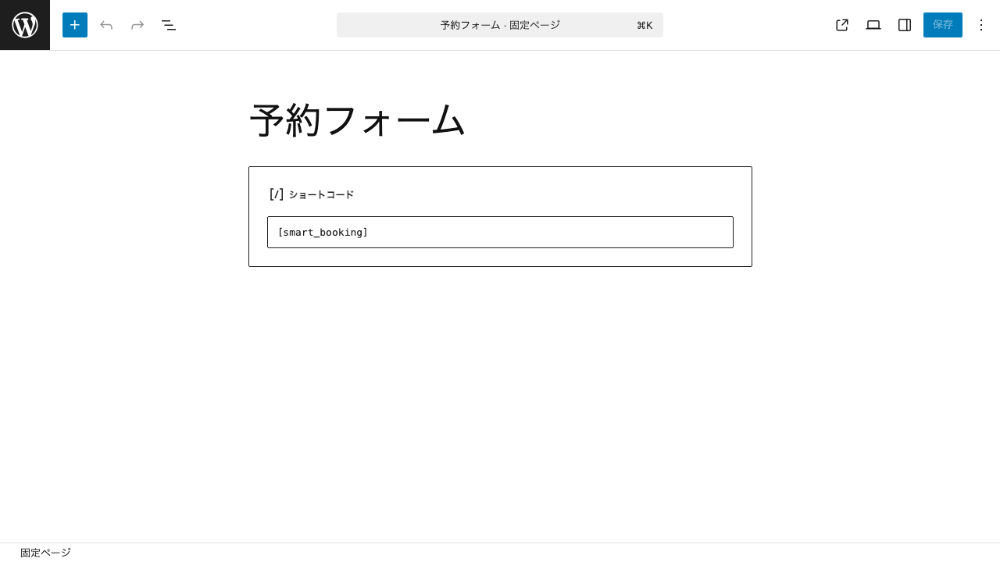
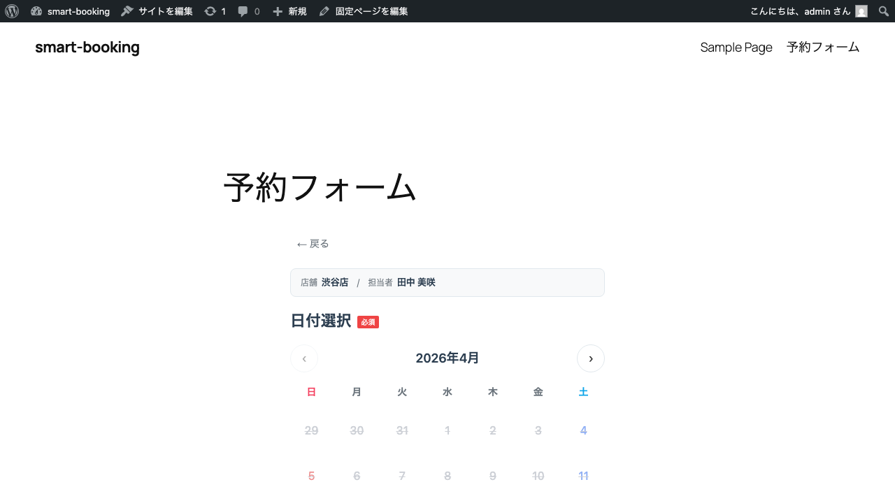
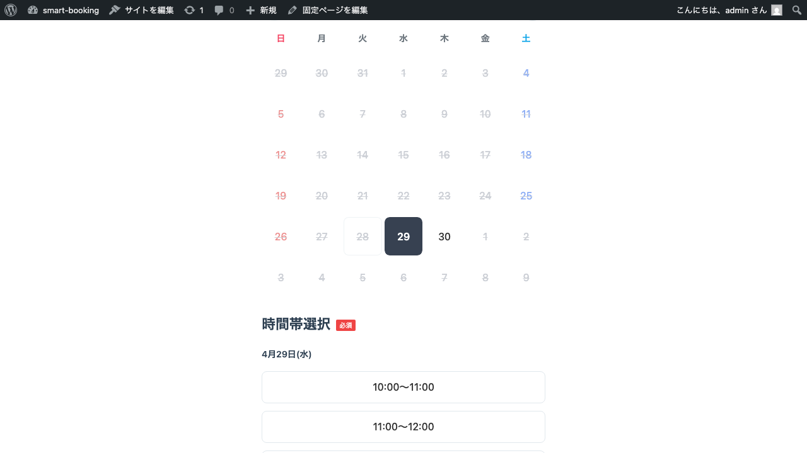
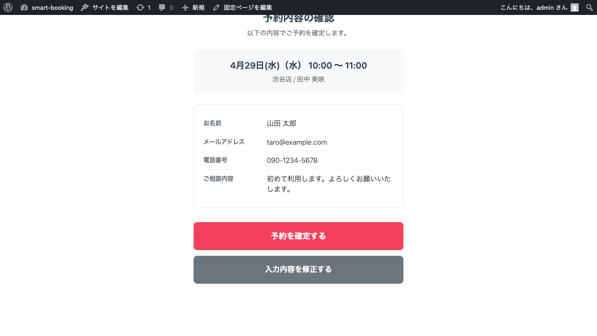
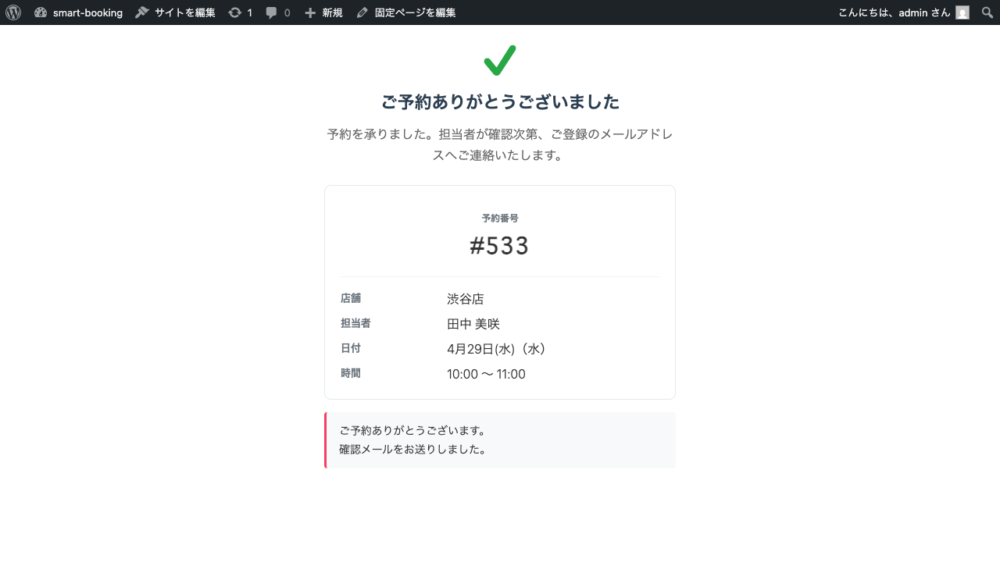

# 予約フォームの設置

このページでは、登録した店舗・担当者・スケジュールをもとに、サイト上に予約フォームを表示する方法を解説します。

## 設置の基本

予約フォームは、WordPressの **ショートコード** で表示します。
固定ページ・投稿・ウィジェットなど、ショートコードが使える場所であればどこにでも設置できます。

ショートコードは次のとおりです。

```
[smart_booking]
```

## 手順: 固定ページに設置する

1. WordPress管理画面の **固定ページ → 新規追加** を開き、ページタイトルを入力します（例: 「ご予約」）。
2. 本文の `+` ボタンから **ショートコード** ブロックを追加し、`[smart_booking]` と入力します。



3. ページを **公開** します。
4. 公開ページにアクセスすると、予約フォームが表示されます。

## 予約フォームの流れ（お客さま視点）

実際の予約フォームでは、以下の順番でステップが進みます。
店舗が1つしかない場合や担当者が1人しかいない場合、その選択ステップは自動的にスキップされます。

### 1. 店舗を選ぶ（店舗が複数ある場合）
### 2. 担当者を選ぶ（担当者が複数いる場合）
### 3. 日付・時間を選ぶ



カレンダー上で日付をクリックすると、その日に空きのある時間枠がボタンで表示されます。



時間枠の表示:

- **空きあり** — 通常表示
- **残りわずか** — オレンジ色のバッジ
- **満席** — グレーアウト・選択不可
- **締切済み** — グレーアウト・選択不可

### 4. お客様情報を入力
氏名・メール・電話番号などの基本項目に加え、管理者が追加したカスタムフィールドが表示されます。

### 5. 内容を確認



入力内容に誤りがないか確認できます。「入力内容を修正する」を押すと、フォーム画面に戻って入力をやり直せます（入力済みの内容は保持されます）。

### 6. 予約完了



予約番号が発行され、確認メールが送信されます。

## 表示順序の切り替え

予約フォームには 2 種類の表示順序が用意されています。
**設定 → 基本設定** から切り替えできます。

- **A. 日付・時間 → フォーム入力**（既定）
- **B. フォーム入力 → 日付・時間**

サイトの導線や運用方針に合わせて選んでください。

## 次のステップ

入力項目を増やしたい場合は [フォームのカスタマイズ](custom-fields.md)、
受け付けた予約の管理は [予約の管理](reservations.md) をご覧ください。
