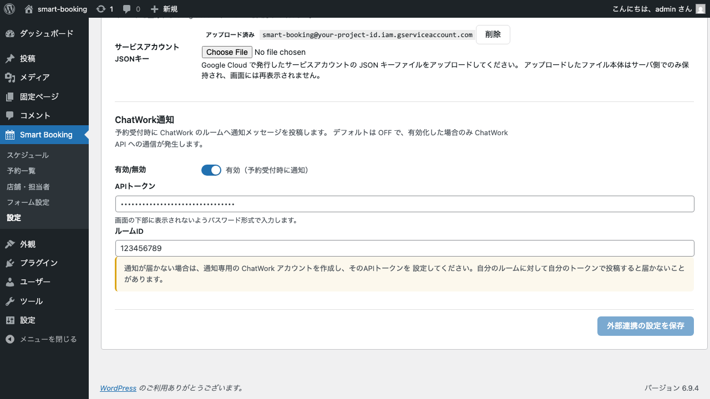

# ChatWork通知連携

このページでは、予約フォームから予約が入ったタイミングで、ChatWorkの指定ルームに通知メッセージを自動投稿する設定方法を解説します。

> このプラグインは、デフォルトでは外部サービスへの通信を一切行いません。
> ChatWork通知を有効化し、APIトークンとルームIDを登録した場合に限り、ChatWork API への通信が発生します。

## 仕組みの概要

予約受付時に、Smart Booking から ChatWork API へメッセージを送信します。
通知は **未読扱い**（`self_unread: 1`）で投稿されるため、ChatWorkクライアントで通知音やバッジが正しく表示されます。

## 設定画面

管理画面の **Smart Booking → 設定 → 外部連携** タブを開き、画面を下にスクロールすると ChatWork通知 セクションがあります。



## 手順

### 1. ChatWork APIトークンを取得

1. ChatWork にログインします。
2. 右上のプロフィールアイコン →「サービス連携」→「API Token」を開きます。
3. 認証手続きを行い、APIトークンをコピーします。

> 通知が届かない場合に備えて、**通知専用のChatWorkアカウント** を作成してそのトークンを使うのがおすすめです。
> 自分自身のトークンで自分が所属するルームに投稿しても、ChatWorkの仕様上、自分には通知が届きません。

### 2. 通知先のルームIDを取得

1. ChatWork で通知先にしたいルーム（チャットグループ）を開きます。
2. ブラウザのURL末尾の数字部分（例: `https://www.chatwork.com/#!rid123456789` の `123456789`）がルームIDです。

### 3. Smart Booking 側で連携を有効化

1. **Smart Booking → 設定 → 外部連携** タブを開きます。
2. **ChatWork通知** セクションの「有効／無効」スイッチをオンにします。
3. **APIトークン** に手順1で取得したトークンを入力します（パスワード形式で表示されます）。
4. **ルームID** に手順2で取得した数字を入力します。
5. 画面下部の **外部連携の設定を保存** をクリックします。

## 動作確認

設定後、予約フォームからテスト予約を1件入れてみてください。
指定したChatWorkルームに、次のような通知メッセージが投稿されます。

```
[予約受付] #533
予約者: 山田 太郎
日時: 2026年4月29日 10:00
店舗: 渋谷店
担当: 田中 美咲
連絡先: taro@example.com / 090-1234-5678
```

## トラブルシューティング

| 症状 | 主な原因 |
|------|----------|
| 通知が届かない | 自分自身のトークンで自分のルームに投稿している（ChatWork仕様） |
| 「認証エラー」になる | APIトークンが古い／無効 |
| 「ルームが見つかりません」 | ルームIDの入力ミス／そのルームの参加権限がない |

## 次のステップ

通知連携まで設定できたら、Googleタグマネージャー経由のコンバージョン計測も検討してみましょう。
詳しくは [GTM（Googleタグマネージャー）連携](gtm.md) をご覧ください。
