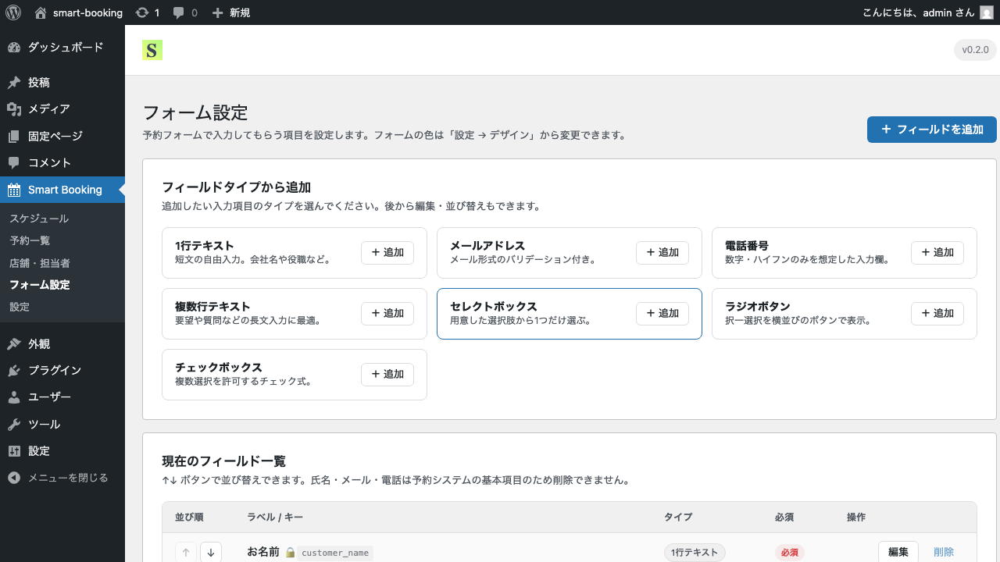

# フォームのカスタマイズ（カスタムフィールド）

このページでは、予約フォームに独自の入力項目を追加する方法を解説します。

## 基本項目とカスタムフィールド

予約フォームには次の3つの基本項目が標準で用意されています。これらは削除できません。

- **お名前**（テキスト）
- **メールアドレス**（メール）
- **電話番号**（電話）

それ以外に、業種や運用に応じて自由な項目を追加できます。これを **カスタムフィールド** と呼びます。

例:
- ご相談内容（テキストエリア）
- ご来店経験（ラジオボタン: 初回／2回目以降）
- 希望する施術（チェックボックス）
- ご年齢（数値）

## 手順: フィールドを追加する

1. 管理画面の **Smart Booking → フォーム設定** を開きます。
2. 画面上部に「フィールドタイプから追加」のカードが並んでいます。
3. 追加したいフィールドのタイプ（カード）をクリックします。

利用できるフィールドタイプ:

| タイプ | 用途 |
|--------|------|
| テキスト | 短文入力（例: 紹介者名） |
| テキストエリア | 長文入力（例: ご相談内容） |
| メール | メールアドレス入力 |
| 電話 | 電話番号入力 |
| 数値 | 数値のみの入力 |
| ラジオボタン | 選択肢から1つだけ選ぶ |
| チェックボックス | 選択肢から複数選択 |
| プルダウン | 選択肢から1つだけ選ぶ（折りたたみ表示） |

4. モーダルが開いたら、ラベル・必須／任意・選択肢などを入力して保存します。
5. 追加したフィールドは「現在のフィールド一覧」に表示されます。

## 編集・並び替え・削除

各フィールドの右側のボタンで操作できます。

- **編集** — ラベルや選択肢の変更
- **↑ ↓** — 並び順を変更（予約フォームの表示順に反映されます）
- **削除** — フィールドを削除

> 基本項目（氏名・メール・電話）は予約システムの動作に必要なため、削除できません。

## 必須／任意の切り替え

各フィールドの編集モーダルで「必須」のチェックを切り替えられます。
必須項目は予約フォームでラベル横に **必須** バッジが表示され、未入力のままでは送信できません。

## 次のステップ

見た目をサイトに合わせて調整するには、[デザインの設定](design.md) をご覧ください。
