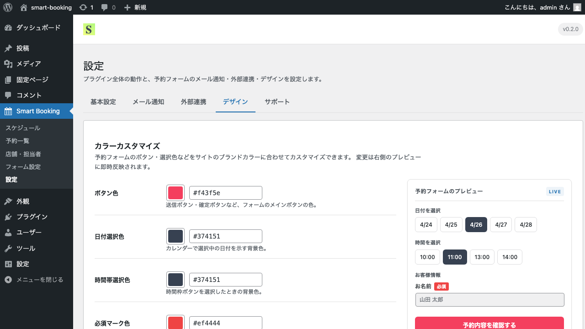

# デザインの設定

このページでは、予約フォームの色をサイトのブランドカラーに合わせて調整する方法を解説します。

## カスタマイズできる項目

管理画面の **Smart Booking → 設定 → デザイン** タブから、以下5項目の色をカスタマイズできます。

| 項目 | 反映箇所 |
|------|----------|
| **ボタン色** | 「予約内容の確認」「予約を確定する」など主要なボタンの背景色 |
| **日付選択色** | カレンダーで日付を選択したときのハイライト色 |
| **時間枠色** | 時間枠ボタンを選択したときのハイライト色 |
| **必須マーク色** | 必須項目ラベル横の「必須」バッジの色 |
| **フォーカス色** | 入力欄をクリックしたときの枠線色（アクセシビリティ対応） |

## 手順: 色を変更する

1. **設定 → デザイン** タブを開きます。
2. 各項目のカラーピッカーをクリックして色を選びます。
3. HEX値（例: `#3B82F6`）を直接入力することもできます。
4. 画面下部の **保存** ボタンをクリックします。
5. 予約フォームを開いて、変更が反映されているか確認します。

## おすすめの設定例

サイトのブランドカラーが青系の場合:

- ボタン色: `#3B82F6`（青）
- 日付選択色: `#1E40AF`（濃い青）
- 時間枠色: `#1E40AF`
- 必須マーク色: `#EF4444`（赤・標準のままでOK）
- フォーカス色: `#3B82F6`

落ち着いたサロンの場合:

- ボタン色: `#374151`（グレー）
- 日付選択色: `#374151`
- 時間枠色: `#374151`
- フォーカス色: `#9CA3AF`

## 色を初期値に戻す

カラー入力欄を空にして保存すると、初期値（プラグイン既定の配色）に戻ります。

## 次のステップ

予約受付時のメール通知をカスタマイズするには、[メール通知の設定](email.md) をご覧ください。
