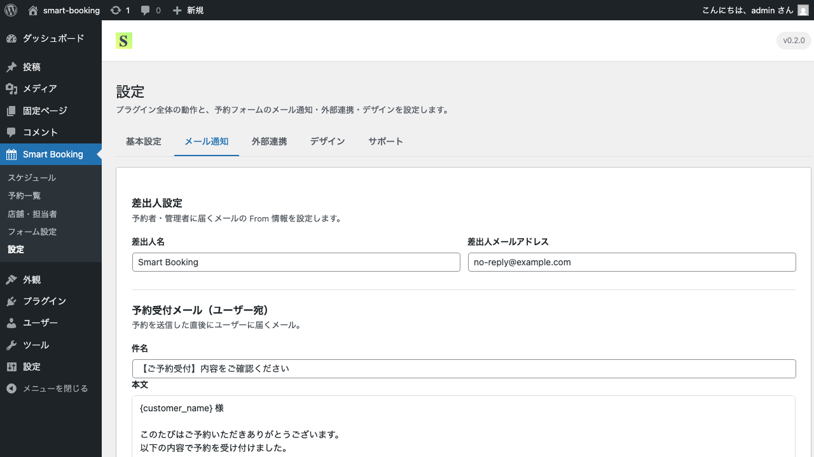

# メール通知の設定

このページでは、予約に関する自動送信メールの内容と送信先の設定方法を解説します。

## 送信されるメールの種類

Smart Bookingは、状況に応じて次の3種類のメールを自動送信します。

| 種類 | 宛先 | 送信タイミング |
|------|------|----------------|
| **予約受付メール（お客さま向け）** | お客さまのメールアドレス | 予約フォーム送信時 |
| **予約通知メール（管理者向け）** | 店舗のメールアドレス + 担当者のメールアドレス（CC） | 予約フォーム送信時 |
| **予約確定メール（お客さま向け）** | お客さまのメールアドレス | 管理者がステータスを「承認」に変更したとき |

## 設定画面

管理画面の **Smart Booking → 設定 → メール通知** タブから設定できます。



## 設定項目

### 共通設定

- **送信元名**（From名）— 例: `渋谷店 予約受付`
- **送信元メールアドレス**（From）— 空欄の場合は WordPress の既定アドレスが使われます
- **管理者通知を送る** — オフにすると管理者向けメールが送られなくなります

### 各メールの件名・本文

3種類それぞれ、件名と本文を編集できます。

### テンプレート変数

本文内では次の変数が使えます。送信時に自動で実際の値に置換されます。

| 変数 | 内容 |
|------|------|
| `{customer_name}` | お客さまのお名前 |
| `{customer_email}` | お客さまのメールアドレス |
| `{customer_phone}` | お客さまの電話番号 |
| `{store_name}` | 店舗名 |
| `{staff_name}` | 担当者名 |
| `{date}` | 予約日（例: 2026年4月29日） |
| `{time}` | 予約時間（例: 10:00） |
| `{reservation_id}` | 予約番号 |

例:

```
{customer_name} 様

このたびはご予約いただきありがとうございます。
以下の内容で予約を受け付けました。

────────────────────────
予約日時: {date} {time}
店舗: {store_name}
担当: {staff_name}
予約番号: {reservation_id}
────────────────────────

ご来店を心よりお待ちしております。
```

## 設定の保存

各セクションを編集したら、画面下部の **保存** ボタンをクリックしてください。

## メールが届かないとき

メールが届かない場合は、以下を確認してください。

1. **送信元メールアドレス** がサーバーで送信可能なドメインか
2. レンタルサーバー側で送信制限がかかっていないか
3. 受信側の迷惑メールフォルダに振り分けられていないか

業務利用の場合は、SMTP送信プラグイン（WP Mail SMTP など）と組み合わせて運用すると、配信品質が安定します。

## 次のステップ

予約をGoogleカレンダーに自動登録するには、[Googleカレンダー連携](google-calendar.md) をご覧ください。
