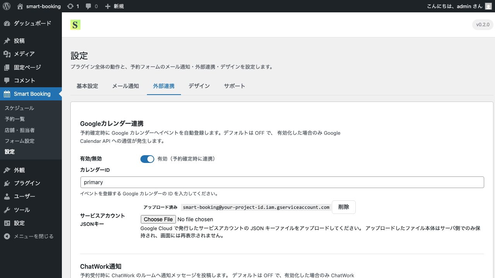

# Googleカレンダー連携

このページでは、予約確定時にGoogleカレンダーへ自動でイベントを登録する連携設定の方法を解説します。

> このプラグインは、デフォルトでは外部サービスへの通信を一切行いません。
> Googleカレンダー連携を有効化し、必要な認証情報を登録した場合に限り、Google Calendar API への通信が発生します。

## 仕組みの概要

Smart Booking は **サービスアカウント方式** で Google Calendar API に接続します。
Googleが発行するサービスアカウントに対して、対象のGoogleカレンダーを共有することで、Smart Bookingが自動的にイベントを登録できるようになります。

## 設定画面

管理画面の **Smart Booking → 設定 → 外部連携** タブを開くと、上部にGoogleカレンダー連携の設定欄が表示されます。

## 手順

### 1. Google Cloud でサービスアカウントを作成

1. [Google Cloud Console](https://console.cloud.google.com/) にログインします。
2. 新しいプロジェクトを作成します（例: `smart-booking`）。
3. 「APIとサービス」→「ライブラリ」から **Google Calendar API** を有効化します。
4. 「APIとサービス」→「認証情報」から **サービスアカウント** を作成します。
5. サービスアカウントの詳細画面で **キーを作成 → JSON** を選び、JSONキーファイルをダウンロードします。

### 2. Googleカレンダーをサービスアカウントと共有

1. 通知を入れたいGoogleカレンダーを開きます。
2. 設定画面の「特定のユーザーまたはグループとの共有」に、サービスアカウントのメールアドレス（`xxx@xxx.iam.gserviceaccount.com`）を追加します。
3. 権限は **「予定の変更権限」** を付与してください。

### 3. Smart Booking 側で連携を有効化

1. **Smart Booking → 設定 → 外部連携** タブを開きます。
2. **Googleカレンダー連携** セクションの「有効／無効」スイッチをオンにします。
3. **カレンダーID** を入力します。
   - メインカレンダーの場合は `primary`
   - 共有カレンダーの場合は、Googleカレンダー設定画面で確認できる `xxx@group.calendar.google.com` 形式のID
4. **サービスアカウントJSONキー** に、ダウンロードしたJSONファイルをアップロードします。
5. 画面下部の **保存** をクリックします。

## 動作確認

設定後、テスト予約を1件作成してみてください。
予約のステータスが **承認済み** に変わったタイミングで、指定したGoogleカレンダーに予約イベントが自動追加されます。

イベントには次の情報が含まれます。

- タイトル: `[店舗名] 予約 #予約番号 - お客様名`
- 開始・終了: 予約の時間枠
- 説明: お客様の連絡先・カスタムフィールド入力内容

## トラブルシューティング

| 症状 | 主な原因 |
|------|----------|
| イベントが作成されない | カレンダーがサービスアカウントと共有されていない／権限が「予定の変更権限」になっていない |
| 「認証エラー」が表示される | JSONキーファイルが破損している／別のサービスアカウントのキー |
| カレンダーが見つかりません | カレンダーIDの入力ミス |

## 次のステップ

ChatWorkにも通知を送りたい場合は、[ChatWork通知連携](chatwork.md) をご覧ください。
