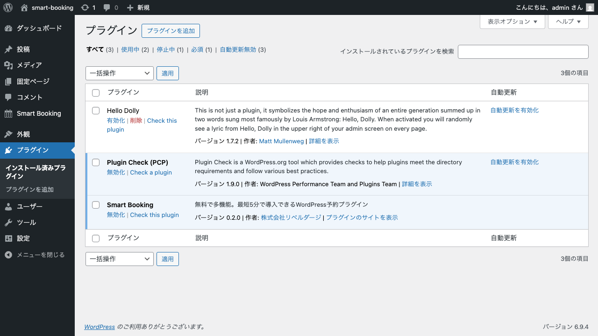
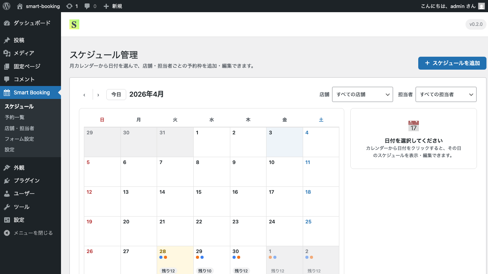

# インストール・有効化

このページでは、Smart Booking プラグインをWordPressに追加し、有効化するまでの手順を解説します。

## 手順

1. WordPress管理画面の「プラグイン」→「新規追加」を開き、Smart Booking のZIPファイルをアップロードします。
2. アップロードが完了したら「今すぐインストール」をクリックします。
3. インストール後、「有効化」をクリックします。
4. 「プラグイン」一覧で **Smart Booking** が「有効」と表示されていれば成功です。

5. 有効化に成功すると、管理画面のサイドバーに **Smart Booking** メニューが追加されます。

サイドバーには以下5つのサブメニューが用意されています。

- **スケジュール** — 予約可能な日付・時間枠の登録
- **予約一覧** — 受け付けた予約の確認・ステータス変更
- **店舗・担当者** — 予約を受け付ける拠点と、その担当者の管理
- **フォーム設定** — 予約フォームの入力項目をカスタマイズ
- **設定** — メール通知・外部連携・デザインなど全体設定

## 次のステップ

最初に登録するのは「店舗」です。続けて [店舗の登録・管理](stores.md) に進んでください。
