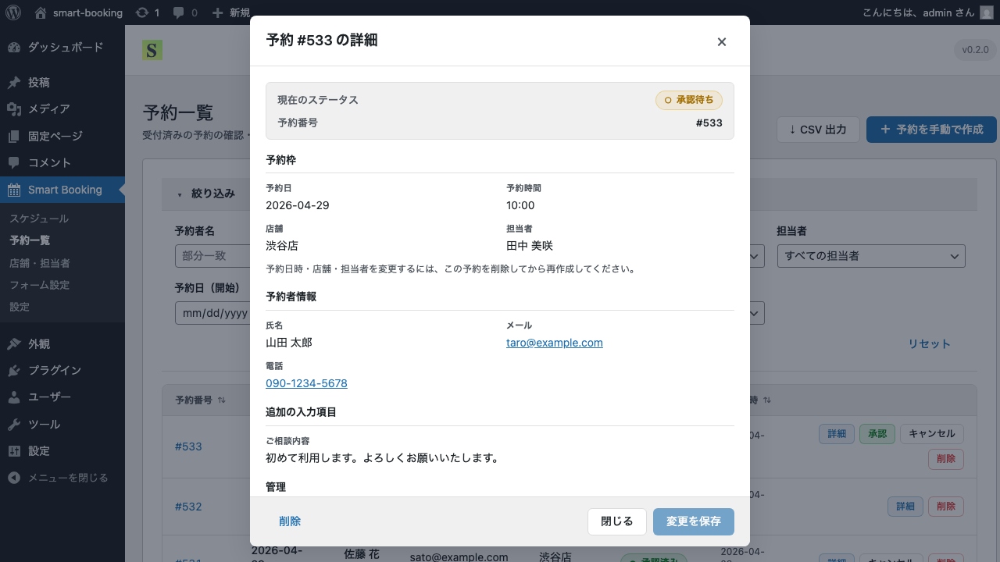
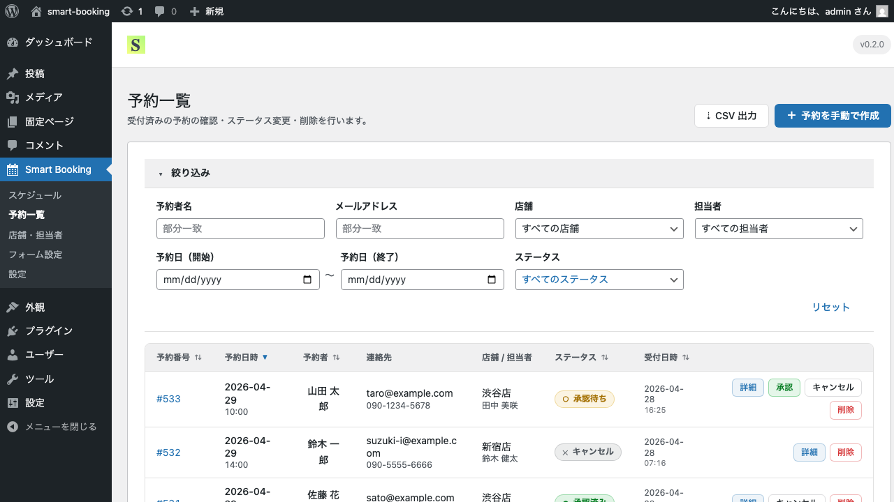

# 予約の管理

このページでは、お客さまから受け付けた予約を確認・管理する方法を解説します。

## 予約一覧画面

管理画面のサイドバーから **Smart Booking → 予約一覧** を開くと、受付済みの予約が新しい順に並びます。

各予約には以下の情報が表示されます。

- **予約番号** — `#001` のような連番
- **予約日時** — お客さまが選択した日時
- **予約者** — お名前・連絡先
- **店舗 / 担当者**
- **ステータス** — 承認待ち／承認済み／キャンセル
- **受付日時** — お客さまがフォームから送信した日時

## 絞り込み（フィルタ）

画面上部の **絞り込み** エリアで、以下の条件で検索できます。

- 予約者名（部分一致）
- メールアドレス（部分一致）
- 店舗
- 担当者
- 予約日（開始〜終了）
- ステータス

複数条件を組み合わせて検索できます。「リセット」ボタンで条件をクリアできます。

## ステータスを変更する

予約のステータスは次のいずれかです。

| ステータス | 意味 |
|-----------|------|
| **承認待ち**（pending） | 受付直後の状態。管理者の確認待ち |
| **承認済み**（approved） | 管理者が承認した状態。お客さまへ確定メールが送信されます |
| **キャンセル**（cancelled） | 予約が取り消された状態。枠は再度予約可能になります |

各行の右側にある **承認** **キャンセル** ボタンで直接変更できます。
**詳細** ボタンをクリックすると、予約の詳細ダイアログが開き、メモの追加なども行えます。

## CSV出力

予約データをCSV形式でダウンロードできます。
画面右上の **↓ CSV出力** ボタンをクリックすると、現在の絞り込み条件に合致する予約がエクスポートされます。

ExcelやGoogleスプレッドシートで開いて、月次レポートや顧客リストの作成にお使いください。

## 予約を手動で作成する

電話やSNSで受けた予約を、管理画面から手動で登録できます。
画面右上の **＋ 予約を手動で作成** ボタンから、店舗・担当者・日時・お客様情報を入力して保存してください。

## 次のステップ

予約フォームに独自の入力項目を追加したい場合は、[フォームのカスタマイズ](custom-fields.md) をご覧ください。
