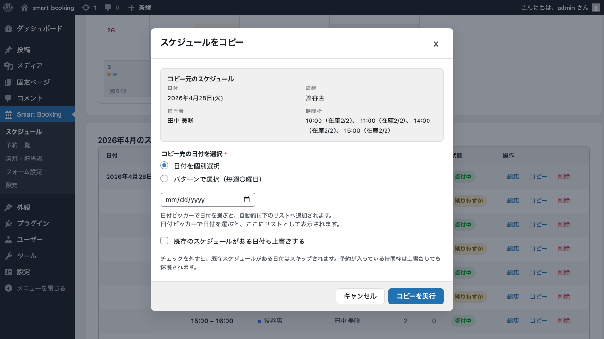
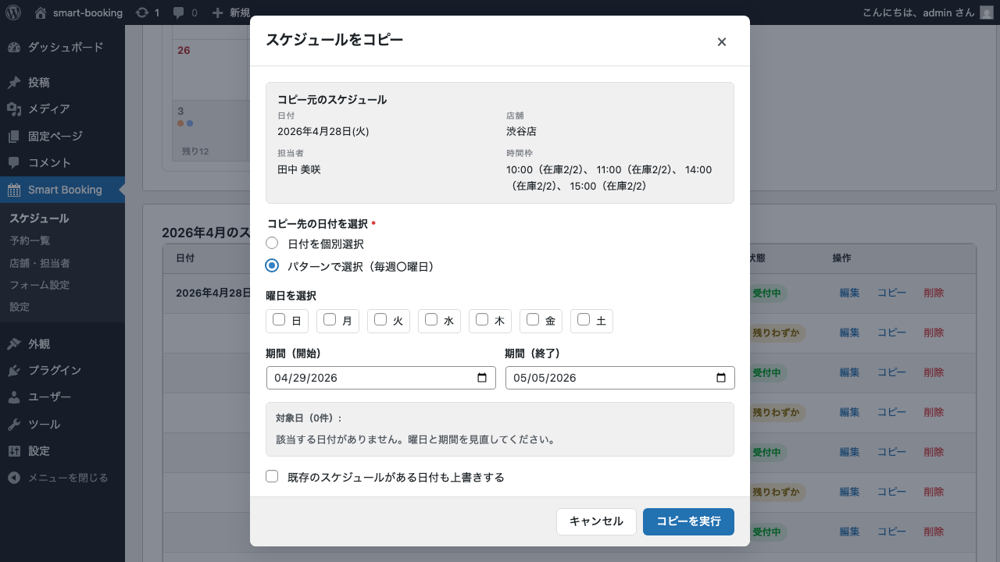

# スケジュールの一括登録（コピー機能）

このページでは、1日分のスケジュールをテンプレートとして、複数日に一気にコピーする方法を解説します。
毎週同じ時間帯で予約を受け付けるサロンや教室では、この機能を使うとスケジュール登録の手間が大きく減ります。

## 2 つのコピーモード

Smart Booking には、用途に応じて 2 つのコピーモードが用意されています。

| モード | 用途 |
|--------|------|
| **日付を個別選択** | 対象日をひとつずつ指定。不規則な日に同じスケジュールを反映したい場合 |
| **パターンで選択（毎週〇曜日）** | 「毎週水曜と金曜、6月末まで」のように曜日と期間で一括指定 |

## 手順: コピー元を選ぶ

1. 管理画面の **Smart Booking → スケジュール** を開きます。
2. コピー元にしたい日付をクリックすると、右側のパネルにその日のスケジュールが表示されます。
3. 各スケジュールの **コピー** ボタンをクリックします。

## モード 1: 日付を個別選択

コピー先となる日付を、日付ピッカーから 1 つずつ追加していきます。

1. 「日付を個別選択」が選ばれていることを確認します。
2. 日付ピッカーで日付を選び、「日付を追加」をクリックします。
3. 必要な日付をすべて追加したら、「コピーを実行」をクリックします。

## モード 2: パターンで選択（曜日 + 期間）

毎週特定の曜日にスケジュールを一括コピーします。

1. 「パターンで選択（毎週〇曜日）」を選択します。
2. **曜日** のチェックボックスから対象曜日を選びます（複数選択可）。
3. **期間** の開始日・終了日を指定します。
4. プレビュー欄に対象日が表示されるので、内容を確認します。
5. 「コピーを実行」をクリックします。

## 既存スケジュールがある場合

コピー先の日付に既にスケジュールが登録されている場合、デフォルトではそのスケジュールは保持されます。
**「既存スケジュールがある日付も上書きする」** チェックボックスをオンにすると、既存のスケジュールを削除してから新しい内容で上書きします。

> 上書きすると元のスケジュールに紐づく予約も整合性が崩れる場合があります。受付済み予約がある日への上書きは慎重に行ってください。

## 次のステップ

スケジュールが揃ったら、いよいよサイトに予約フォームを設置します。
[予約フォームの設置](booking-form.md) へ進んでください。
