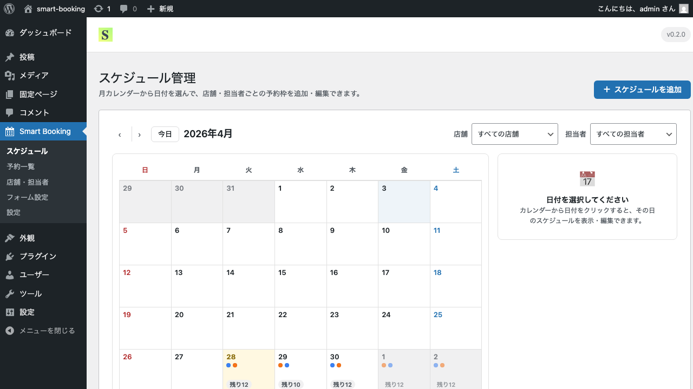
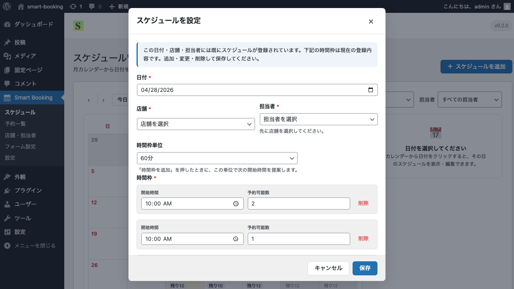

# スケジュールの登録

このページでは、予約を受け付ける日付と時間枠の登録方法を解説します。

## スケジュールとは

スケジュールとは、「いつ・誰が・何件まで予約を受けられるか」を定義したものです。
1日のなかに複数の時間枠を作り、各枠ごとに **定員（予約可能数）** を設定できます。

例:
- 渋谷店／田中先生／2026-04-29／10:00 〜 11:00／定員 2 名
- 渋谷店／田中先生／2026-04-29／11:00 〜 12:00／定員 2 名

## 手順: スケジュールを追加する

1. 管理画面の **Smart Booking → スケジュール** を開きます。
2. 月カレンダーが表示され、登録済みのスケジュールが日付セルに点（ドット）で表示されています。
3. 画面右上の **＋ スケジュールを追加** ボタンをクリックします。

4. 「スケジュールを追加」モーダルが表示されます。

入力項目:

- **日付**（必須）
- **店舗**（必須）— 登録済みの店舗から選択
- **担当者**（必須）— 選択した店舗に所属する担当者から選択
- **時間枠**（必須）
  - 開始時間（例: 10:00）
  - 終了時間（例: 11:00）
  - 予約可能数（例: 2）
- **時間枠を追加** ボタンで複数の枠を一度に登録できます

5. 「保存」をクリックすると、カレンダーに反映されます。

スケジュールが入っている日付には小さなドットが表示されます。日付セルをクリックすると、その日のスケジュール詳細が右側のパネルに表示されます。

## 編集・削除

カレンダーで日付をクリックして表示される詳細パネルから、各スケジュールを編集・コピー・削除できます。

## 表示期間と予約締切の設定

設定画面の「基本設定」タブで、以下を調整できます。

- **表示期間** — フロントの予約フォームに何日先まで表示するか（既定 60 日）
- **予約締切** — 何日前／何時間前まで予約を受け付けるか（例: 当日0時まで／3日前まで）

## 次のステップ

複数日に同じスケジュールを一気に登録したい場合は、便利なコピー機能があります。
[スケジュールの一括登録](schedule-copy.md) をご覧ください。
