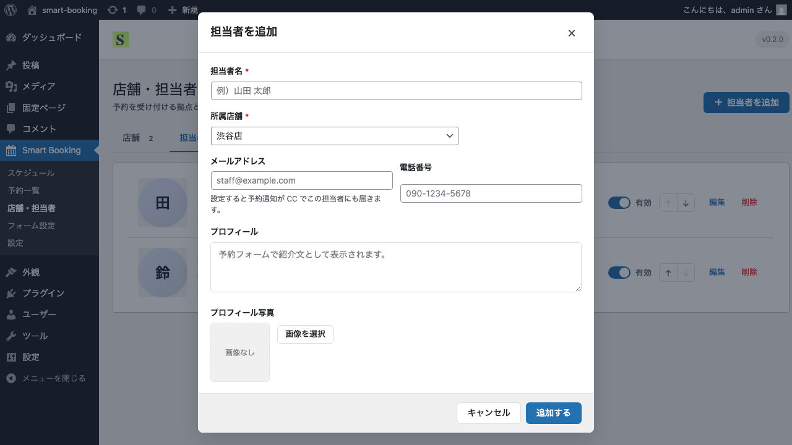
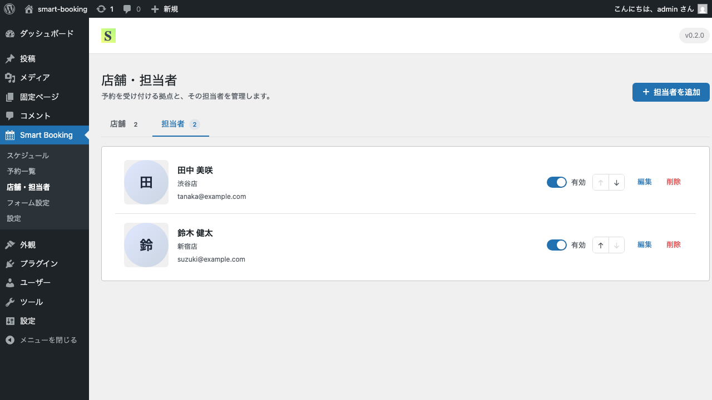

# 担当者の登録・管理

このページでは、各店舗に所属する担当者（スタッフ）の登録方法を解説します。

## 担当者とは

担当者は、お客さまの予約を担当する人を表します。1店舗あたり何人でも登録できます。
複数の担当者を登録した場合、予約フォームでは店舗選択のあとに「担当者を選んでください」という選択画面が表示されます。担当者が1人しかいない場合は、このステップは自動的にスキップされます。

> 担当者は **必ず1つの店舗に所属** します。先に店舗を登録してから担当者を追加してください。

## 手順: 担当者を追加する

1. 管理画面の **Smart Booking → 店舗・担当者** を開きます。
2. 画面上部の **担当者** タブをクリックします。

3. 画面右上の **＋ 担当者を追加** ボタンをクリックします。
4. 「担当者を追加」モーダルが表示されます。各項目を入力してください。

入力項目:

- **所属店舗**（必須）— ドロップダウンから選択
- **担当者名**（必須）— 例: 田中 美咲
- **メールアドレス** — 予約通知メールのCC先（管理者メールに加えて送信）
- **紹介文** — 予約フォームの担当者カードに表示されます
- **プロフィール画像** — メディアライブラリから選択

5. 「保存」をクリックすると、担当者一覧に追加されます。

## 担当者の編集・削除・並び替え

各担当者の右側のボタンで操作できます。

- **編集** — 担当者情報の修正
- **↑ ↓** — 並び順の変更
- **有効／無効スイッチ** — 一時的に予約受付対象から外したいときに利用
- **削除** — 紐づくスケジュール・予約も含めて削除されます

## 次のステップ

店舗と担当者の登録が終わったら、いよいよ予約可能な時間枠を作成します。
[スケジュールの登録](schedule.md) へ進みましょう。
