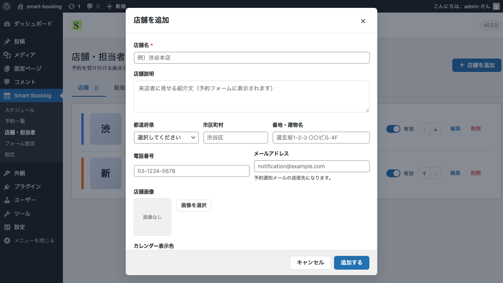
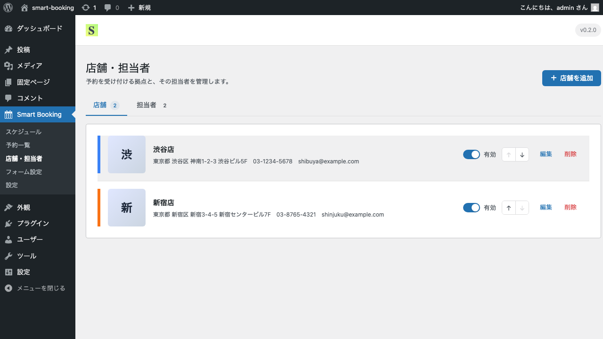

# 店舗の登録・管理

このページでは、予約を受け付ける店舗の登録方法を解説します。1つの店舗から、複数店舗まで対応しています。

## 店舗とは

Smart Booking における「店舗」は、予約を受け付ける拠点を表します。サロン・クリニック・教室など、お客さまが来店する場所のことだとお考えください。

複数店舗を登録すると、予約フォームの最初に「店舗を選んでください」という選択画面が表示されます。1店舗のみの場合、この選択ステップは自動的にスキップされ、いきなり日付選択から始まります。

## 手順: 店舗を追加する

1. 管理画面のサイドバーから **Smart Booking → 店舗・担当者** を開きます。
2. 画面右上の **＋ 店舗を追加** ボタンをクリックします。

3. 「店舗を追加」モーダルが表示されます。各項目を入力してください。

入力項目:

- **店舗名**（必須）— 例: 渋谷店
- **電話番号** — 例: 03-1234-5678
- **メールアドレス** — 予約通知メールの宛先になります
- **住所**（都道府県／市区町村／番地）
- **店舗紹介文** — 予約フォームの店舗カードに表示されます
- **店舗イメージ画像** — メディアライブラリから選択
- **カレンダー色** — 管理画面のスケジュール表示で使われる識別カラー

4. 「保存」ボタンをクリックすると、店舗一覧に追加されます。

## 店舗の編集・削除・並び替え

各店舗の右側にあるボタンで操作できます。

- **編集** — 店舗情報の修正
- **↑ ↓** — 並び順の変更（予約フォームの店舗選択画面に反映されます）
- **有効／無効スイッチ** — 一時的に予約受付を停止したいときに利用
- **削除** — 紐づいているスケジュール・予約も含めて削除されます

> 削除する前に、その店舗で受け付けた既存予約がないかご確認ください。

## 次のステップ

店舗を登録したら、次は [担当者の登録・管理](staff.md) に進みます。
